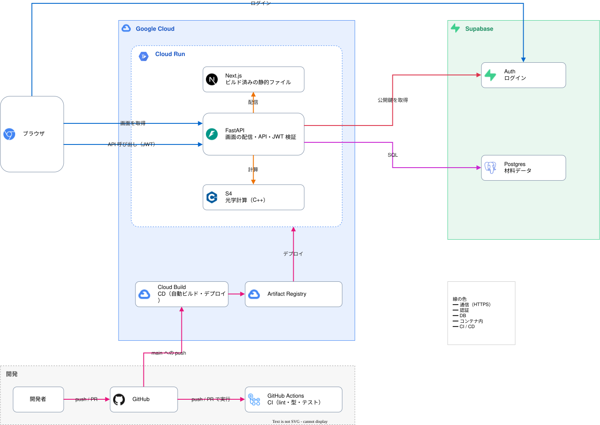

<div align="center">


</div>

## クイックスタート

以下がインストールされている必要があります。

- [uv](https://docs.astral.sh/uv/)
- Node.js
- C++ コンパイラ(RCWA ソルバー [S4](https://web.stanford.edu/group/fan/S4/) のビルドに使用)

```bash
git clone https://github.com/sotaro711/Morpho.git
cd Morpho
(cd backend && uv sync)      # 初回は S4 のビルドが走ります
(cd frontend && npm install)
cp backend/.env.example backend/.env     # Supabase の URL と DB の接続文字列を記入
cp frontend/.env.example frontend/.env   # Supabase の URL と publishable key を記入
./dev.sh                     # バックエンド :8000 / フロントエンド :3000
```

http://localhost:3000 でシミュレーターが開きます。API ドキュメントは http://localhost:8000/docs で確認できます。

### Docker で起動する場合

```bash
docker build -t morpho \
  --build-arg NEXT_PUBLIC_SUPABASE_URL=https://<project>.supabase.co \
  --build-arg NEXT_PUBLIC_SUPABASE_PUBLISHABLE_KEY=sb_publishable_... .
docker run --rm -p 8080:8080 \
  -e SUPABASE_URL=https://<project>.supabase.co \
  -e DATABASE_URL='postgresql://...:6543/postgres' morpho
```

http://localhost:8080 で開きます。

## アーキテクチャ


